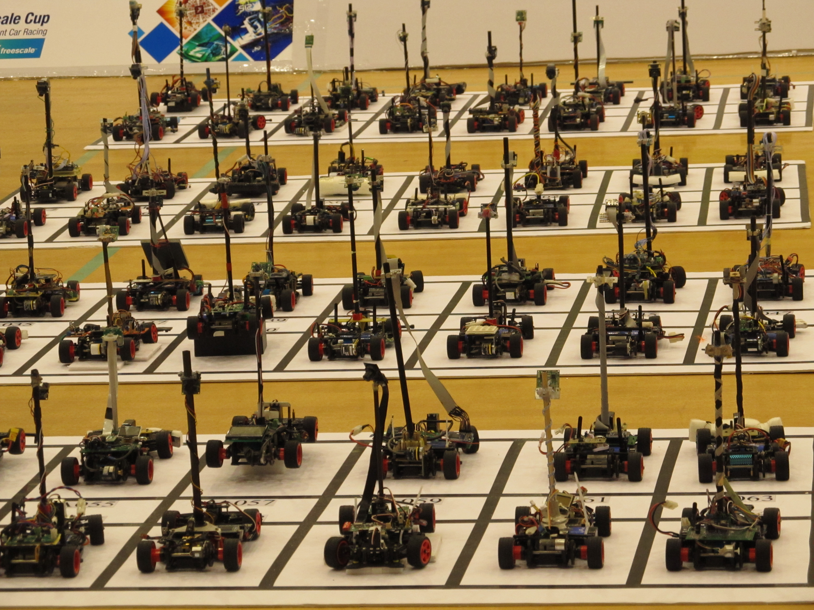
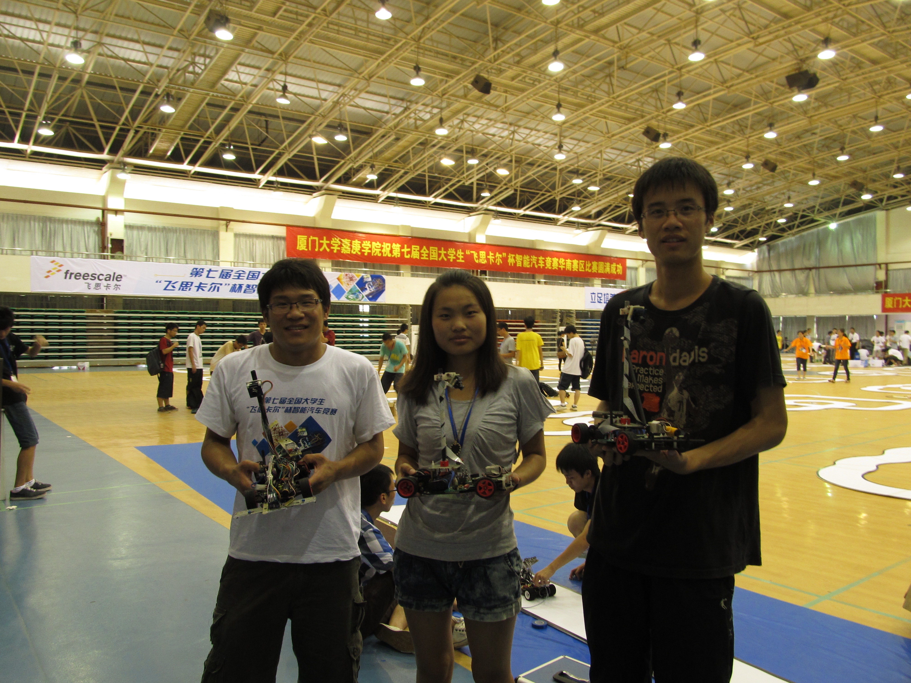

# Freescale-Cup
I participated in the 7th Freescale Cup: Intelligent Car Racing in 2012 and wrote the code for the competition when I was junior. The competition was held in Xiamen, China and included over 300 teams. The performance of our intelligent car can be seen in my youtube channels [Preliminary competition vedio](https://youtu.be/EjKdjxUqkzo) and [Final competition vedio](https://youtu.be/WgwOIf9HDZs)

# Introduction of system
The code is written with C, and run in the microcontroller [**MC9S12XS128**](https://www.nxp.com/docs/en/product-brief/MC9S12XS256PB.pdf). In this competition, a CMOS camera whose type is ov7620, was used to capture track, and a MC9S12XS128 was employed to process input data (e.g. track extraction and track classification) and outputted controlling signals. The car model is specified by sponsors, so are steering and speed motors. All code is included in folder: Code_Intelligent Car.

Two simulation tools are develped with visual studio to display the speed line, running trajectory, controlling output and steering offset. All codes residue in folder: Debug_smulation.

